  <em>Diabetic Patient Readmission Risk Prediction </em>

<!-- Badges -->

# Diabetic Patient Readmission Risk Prediction 
## 📋A Scalable E2E Solution using PySpark, Databricks, and Power BI

In this project, a machine learning solution to predict diabetic patient readmission risk based on healthcare input data was developed. The implementation leverages **PySpark** for distributed data processing and **Power BI** for interactive visualization and business intelligence.

#### 🎥 Part 1: The Project "Trifecta"

| Video Walkthrough (5 min)            | Interactive PCA Visualization      | Public Notebook                  |
| ------------------------------------ | ---------------------------------- | -------------------------------- |
| *[Screenshot here]*                  | *[Screenshot here]*                | *[Screenshot here]*              |
| **[▶ Click Here to Watch the Loom]** | **[✨ Interact with the PCA Plot]** | **[📓 Open the Colab Notebook]** |
---
#### 🎯 Part 2: The Executive Summary (The "So What?")    
**Fictional Client:** Head of Clinical Operations, 'CityView Health System'     

**The Problem:**  The high frequency of unplanned readmissions for diabetic patients within 30 days of discharge drives up healthcare costs, hinders operational efficiency, and serves as a key benchmark for assessing hospital care quality. In the US, preventable readmission costs **$26 billion annually**, and our hospital's 30-day readmission rate is **18%**, 3 points above the national average.    

**The Solution:** I developed a scalable machine learning pipeline to **predict which diabetic patients are most likely to be readmitted within 30 days**. This tool empowers hospital teams to prioritize high-risk patients for proactive, post-discharge interventions (e.g., follow-up calls, home care visits).     
  
**📈 The Outcome**: The final model (LightGBM) **identifies high-risk patients with 0.72 ROC AUC** (see performance note below). The analysis revealed that readmission risk is shaped by a mix of clinical severity, care transitions, and patient complexity. Key drivers include `Discharge Disposition`, `Time in Hospital`, and `Metformin adjustments`.   

#### 🎯 Part 3: Technical Architecture (The "How?")      
  
##1. Project Architecture:     

```mermaid   
flowchart TD
    %% --- Nodes ---
    A[📥 Raw Data Source<br>EHR Diabetes Dataset]:::source
    B[🛠 ETL & Feature Engineering]:::process
    C[🔍 Model Selection]:::process
    D[🤖 Model Training<br>LightGBM]:::model
    E[🔁 Cross Validation & Hyperparameter Tuning]:::model
    F{✅ Performance OK?}:::decision
    G[📊 Prediction Output<br>Yes / No]:::output
    H[🚀 Deployment & Monitoring]:::monitor
    I{⚠️ Data Drift Detected?}:::decision
    %% --- Flow Arrows ---
    A --> B --> C --> D --> E --> F
    F -- "No" --> E
    F -- "Yes" --> G --> H
    %% Drift loop
    H --> I
    I -- "Yes" --> E
    I -- "No" --> H
    %% --- Node Styles ---
    classDef source fill:#4CAF50,stroke:#1B5E20,color:#fff;
    classDef process fill:#29B6F6,stroke:#0277BD,color:#fff;
    classDef model fill:#FF7043,stroke:#E64A19,color:#fff;
    classDef decision fill:#FDD835,stroke:#F9A825,color:#000;
    classDef output fill:#66BB6A,stroke:#2E7D32,color:#fff;
    classDef monitor fill:#AB47BC,stroke:#6A1B9A,color:#fff;
```

## 2. Strategic Tech Choices:

**🔷 Why PySpark on Databricks?** Most such datasets contain over 100,000 patient encounters. A standard single-machine workflow (Pandas) would be slow and inefficient. I chose PySpark on Databricks to build a robust, scalable, and production-ready ETL pipeline that can handle this volume and be easily adapted to a live, streaming EMR data feed.    
**🔷 Why Power BI?** The model's output (a risk score) is useless unless it's in the hands of a non-technical clinician. I built an interactive Power BI dashboard to translate the model's complex output into a simple, actionable "High/Medium/Low Risk" flag for doctors and care managers.     

##🔍 Part 4: Insights Deep Dive (The "What Did You Find?")   

**🏥 Finding 1: Discharge Disposition - The Path Home Matters**   
**Insight:**     
Non-home discharges (e.g., to a rehab facility or skilled nursing facility) **increase readmission risk by 2.3x**. This is a critical moment of care transition.     
**Priority Action:** Implement enhanced care coordination and data sharing for patients not being discharged directly to their homes.     
    

**⏰ Finding 2: Time in Hospital - The Clock of Severity** 
**Insight:** Risk increases significantly with length of stay. Stays of **7–10 days increase readmission risk by 60%** compared to shorter stays, indicating higher patient complexity.    
**Priority Action:** Automatically flag patients with stays > 7 days for a mandatory post-discharge consultation with a care specialist.     
    

**🎯 Finding 3: Metformin - A Key Medication Marker**   
**Insight:** Patients who had their **Metformin dosage** changed or were newly prescribed it are **1.8x more likely to be readmitted**. This signals potential issues with medication adherence or diabetes management.
**Priority Action:** Implement targeted medication counseling and follow-up for any patient whose diabetes medication regimen is altered during their hospital stay.
      

## Part 5: Actionable Recommendations (The "Now What?")    
**For Care Management (The "Users"):**    
**Action:** Use the Power BI dashboard to **stratify all discharging patients** into risk tiers. Enroll all "High-Risk" patients in an automated 48-hour follow-up call system.   

**For Clinical Leadership (The "Strategists"):**
**Action:** Launch a 'deep-dive' investigation into the **top 3 Discharge Dispositions** driving readmissions to identify gaps in our partner facility network.
**For the Data & IT Team (The "Peers"):**
**Action:** The next step is to move this model from a static CSV to a **live EMR data stream**. The PySpark foundation is already built, allowing for a transition to real-time risk scoring.

##📊 Part 6: Model Performance
A note on metrics for this imbalanced dataset. The target variable (`readmitted < 30 days`) only represents ~11% of the data. This means a naive model that always predicts "No Readmission" would have 89% accuracy. 
Therefore, **Accuracy is a misleading metric.**

The primary metric for this business problem is **ROC AUC** (Area Under the Receiver Operating Characteristic curve), which measures the model's ability to distinguish between the positive and negative classes.
🔷**Final Model (LightGBM): ROC AUC 0.72** 

## Part 7: Repository & How to Run
**1. Repository Structure:**

├── 📂 notebooks/
│   ├── 🔗 01_Data_Ingest_and_ETL_(PySpark).ipynb
│   ├── 🔗 02_Feature_Engineering_(PySpark).ipynb
│   ├── 🔗 03_Model_Training_and_Evaluation.ipynb
│   └── 🔗 04_Insight_Generation_and_Visualization.ipynb
├── 📂 data/
│   └── 📄 README.md  (Explains how to download the "Diabetes 100k-US hospitals" dataset)
├── 📂 images/
│   ├── 🖼️ trifecta_loom.png
│   ├── 🖼️ trifecta_dashboard.png
│   ├── 🖼️ trifecta_notebook.png
│   ├── 🖼️ architecture_flowchart.png
│   ├── 🖼️ discharge_disposition_chart.png
│   ├── 🖼️ time_in_hospital_chart.png
│   ├── 🖼️ metformin_chart.png
│   └── 🖼️ roc_curve.png
├── 🔗 Hospital_Readmission_Dashboard.pbix
└── 🔗 requirements.txt

## 2. How to Run:
Download the "Diabetes 130-US hospitals" dataset (instructions in /`data/README.md`).
Import the PySpark notebooks into your Databricks environment.
Run the ETL -> Feature Engineering -> Modeling pipeline sequentially.
Open the Power BI file (`Hospital_Readmission_Dashboard.pbix`) to explore the interactive results.

## 📄 License
This project is licensed under the **MIT License**.

---

